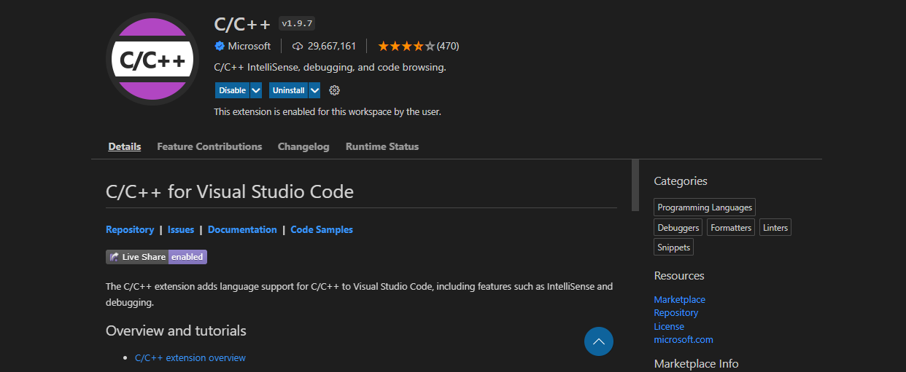
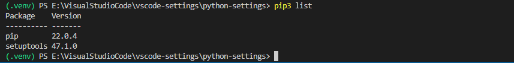

# vscode-settings
一些VS Code的常用配置文件

## 一、C/C++
1. [Mingw-w64下载](https://www.msys2.org/)：C/C++程序编译器;  
2. C/C++（VS Code Extensions）：VS Code插件商店搜索**C/C++**  
      

## 二、Python
1. 创建虚拟环境：
    ```PowerShell
    py -3 -m venv .venv
    ```
2. 激活虚拟环境：
    ```PowerShell
    .venv\Scripts\activate
    ```
    激活后，会在PS命令提示符前显示`(.venv)`字符，如下图所示：  
    
    **说明**：若VS Code内置的PowerShell禁止运行脚本，可以以管理员身份打开windows上的powershell，更改执行策略，详见[about_Execution_Policies](https://docs.microsoft.com/zh-cn/powershell/module/microsoft.powershell.core/about/about_execution_policies?view=powershell-7.2)
3. 安装相关库，例如：
    ```PowerShell
    pip3 -m install matplotlib
    ```
4. 执行Python脚本，按`F5`键，选择第一个**Python File**，即可执行，不需要额外安装依赖。